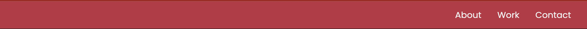
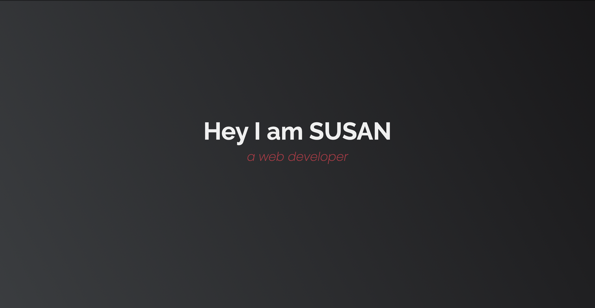
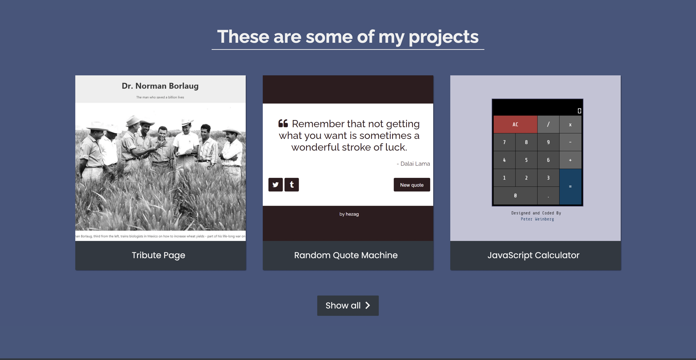
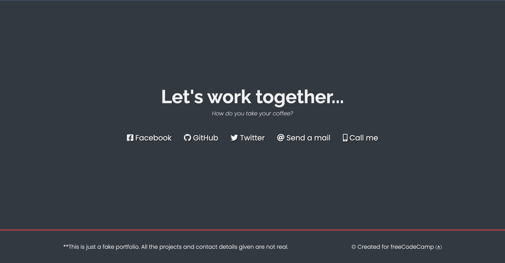

# Personal Portfolio
In this practice you will re-create the following portfolio.

### Section 1


### Section 2


### Section 3


### Section 4



### 0. Clone the public repository

Here you will clone the repository, and a personal branch. You will publish your work on your peronal branch.

Open your terminal and type:  
>  `cd`  
>  `mkdir -p practices/html/personal-portfolio`  
>  `cd practices/html/personal-portfolio`  
>  `git clone https://github.com/onja-org/w2_html_personalPortfolio.git`  
>  `git checkout -b <your-name>-personal-portfolio-main` (⚠️)  
>  `code .`

**⚠️ ABOUT `git checkout -b <your-name>-personal-portfolio-main`:**  
you need to replace `<your-name>` with your real name. For example if your name is David Holmes, you need to run `git checkout -b david_holmes-personal-portfolio-main`

### 1. Lets build the portfolio

The code you will work on is html/personal-portfolio/index.html

## <span style="color:red"> Remember to write all code snippets rather than copying. It is very important for your learning to that.</span>

When building websites, it is important to build section by section

#### SECTION 1

First thing, lets build a navbar. For that, we will use the `nav` tag. 
```html
    <nav id="navbar" class="nav">
    </nav>
```

You should see a red bar on the top of your page, but it is missing content. Lets add it:
```html
    <nav id="navbar" class="nav">
        <ul class="nav-list">
            <li>
                About
            </li>
            <li>
                Work
            </li>
            <li>
                Contact
            </li>
        </ul>
    </nav>
```

This will look simmilar but not exactly what we want yet. For that we need to make them into links. We need a tags to make them clickable and navigate us to the appropriate place.
```html
    <nav id="navbar" class="nav">
      <ul class="nav-list">
        <li>
          <a href="#welcome-section"> About </a>
        </li>
        <li>
          <a href="#projects"> Work </a>
        </li>
        <li>
          <a href="#contact"> Contact </a>
        </li>
      </ul>
    </nav>
```

#### SECTION 2

Next we can build section 2.
```html
    <section 
      id="welcome-section"
      class="welcome-section"
    >
      <h1>Hey I am {name}</h1>
      <p>a web developer</p>
    </section>
```
You can replace the name with anything you want. 

#### SECTION 3

For section 3, it is going to be a bit nested. Remember the box model, there are three sections within this section.


We can divide this section into 3 parts: `These are some of my projects`, `project boxes` and `show all`.
```html
    <!-- START PROJECTS SECTION -->
    <section id="projects" class="projects-section">

      <h2 class="projects-section-header">These are some of my projects</h2>
      <!-- add project boxes here -->
      <a
        href="https://codepen.io/FreeCodeCamp/"
        class="btn btn-show-all"
        target="_blank"
      >
        Show all
        <i class="fas fa-chevron-right"></i>
      </a>

    </section>
    <!-- END PROJECTS SECTION -->
```
We have the `These are some of my projects` and `show all` parts. 

Now let's add our `project boxes`. You will add the snippet below inside the section tag, between the “title” and the “Show all” parts.”
```html
      <div class="projects-grid">
        <a
          href="https://codepen.io/freeCodeCamp/full/zNqgVx"
          target="_blank"
          class="project project-tile"
        >
          
          <p class="project-title">
            <span class="code">&lt;</span>
            Tribute Page
            <span class="code">&#47;&gt;</span>
          </p>
        </a>
        <a
          href="https://codepen.io/freeCodeCamp/full/qRZeGZ"
          target="_blank"
          class="project project-tile"
        >
          
          <p class="project-title">
            <span class="code">&lt;</span>
            Random Quote Machine
            <span class="code">&#47;&gt;</span>
          </p>
        </a>
        <a
          href="https://codepen.io/freeCodeCamp/full/wgGVVX"
          target="_blank"
          class="project project-tile"
        >
          
          <p class="project-title">
            <span class="code">&lt;</span>
            JavaScript Calculator
            <span class="code">&#47;&gt;</span>
          </p>
        </a>
      </div>
```

#### SECTION 4

For this part, we need a section (containing the `Let's work together` slogan and the contact icons), and a footer.

First, let's build the section with the slogan only, and the footer.
```html
    <section id="contact" class="contact-section">
      <div class="contact-section-header">
        <h2>Let's work together...</h2>
        <p>How do you take your coffee?</p>
      </div>
      <!-- add here the contact icons -->
    </section>

    <footer>
      <p>
        **This is just a fake portfolio. All the projects and contact details
        given are not real.
      </p>
      <p>
        &copy; Created for
        <a href="https://www.freecodecamp.com/" target="_blank"
          >freeCodeCamp <i class="fab fa-free-code-camp"></i
        ></a>
      </p>
    </footer>
```
Now it looks close to what we see for section 4. 

The only thing missing is the contact icons. Let's add those.
This will go inside section tag and after the `contact-section-header` div.
```html
      <div class="contact-links">
        <a
          href="https://facebook.com/freecodecamp"
          target="_blank"
          class="btn contact-details"
        >
        <i class="fab fa-facebook-square"></i> Facebook
        </a>
        <a
          id="profile-link"
          href="https://github.com/freecodecamp"
          target="_blank"
          class="btn contact-details"
        >
        <i class="fab fa-github"></i> GitHub
        </a>
        <a
          href="https://twitter.com/freecodecamp"
          target="_blank"
          class="btn contact-details"
        >
        <i class="fab fa-twitter"></i> Twitter
        </a>
        <a 
          href="mailto:example@example.com"
          class="btn contact-details"
        >
        <i class="fas fa-at"></i> Send a mail
        </a>
        <a 
          href="tel:555-555-5555"
          class="btn contact-details"
        >
        <i class="fas fa-mobile-alt"></i> Call me
        </a>
      </div>
```


Now we have built the website like the images. Feel free to play around and customize the site to your liking.

### 2. Publish the portfolio

Open the integrated terminal in vs code:  
>  `cd`  
>  `cd practices/html/personal-portfolio`  
>  `git add .`  
>  `git commit -m "portfolio initial version"`  
>  `git push --set-upstream origin <your-name>-personal-portfolio-main` (⚠️)  

**⚠️ Don't forget to replace:** `<your-name>`

### 3. Add an easter egg branch and merge it to your main

Open the integrated terminal in vs code:  
>  `cd`  
>  `cd practices/html/personal-portfolio`  
>  `git checkout -b <your-name>-personal-portfolio-egg` 
>  `touch "my favorite music is <your-favorite-music>" > <your-name>-egg.txt` (⚠️)  
>  `git commit -m "my easter egg"`  
>  `git push --set-upstream origin <your-name>-personal-portfolio-egg` (⚠️)  
>  `git checkout <your-name>-personal-portfolio-main` (⚠️)  
>  `git merge <your-name>-personal-portfolio-egg` (⚠️)  
>  `git push origin`  

**⚠️ Don't forget to replace:** `<your-name>` and  `<your-favorite-music>`


### 4. Let's investigate

The goal here is to see what other students have pushed.
Find their easter eggs.

Open the integrated terminal in vs code:  
> `cd practices/personal-portfolio`  
> `git branch -a` and find the branches other students created  
> `git checkout <others-branches>` (⚠️)  

**⚠️ Don't forget to replace:** `<others-branches>` with the real name of other students branch
and open their easter egg to see the content.


This is the end of the practice,
Hope you had fun